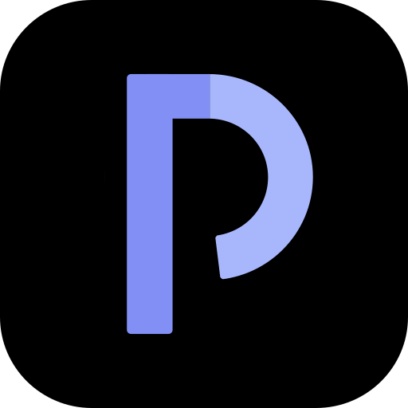

<p align="center">
  
</p>

# P-Cast

A client-side podcast player PWA built with SvelteKit 2 and Svelte 5. Search, subscribe, download, and listen — all in the browser with IndexedDB storage.

## Features

- **Discover podcasts** — Browse top podcasts or search via iTunes Search API
- **Subscribe & manage** — Save your favorite shows locally
- **Offline playback** — Download episodes for listening without internet
- **Offline detection** — Shows a banner when offline; search is gracefully disabled while cached content remains accessible
- **Resume playback** — Automatically saves your position and resumes where you left off
- **Auto-play next** — Automatically plays the next unplayed episode from the same podcast
- **Playback speed** — Adjustable speed (1.0x, 1.2x, 1.5x, 2.0x)
- **Media controls** — Background playback with lock screen controls via Media Session API
- **Keyboard shortcuts** — Space (play/pause), J (-10s), L (+10s)
- **Multilingual** — Japanese and English UI
- **No account required** — All data stays on your device

## Tech Stack

- [SvelteKit 2](https://svelte.dev/) (SPA mode) + [Svelte 5](https://svelte.dev/) (runes)
- [Tailwind CSS 4](https://tailwindcss.com/)
- [Dexie.js](https://dexie.org/) (IndexedDB wrapper)
- [Vite PWA](https://vite-pwa-org.netlify.app/) for offline support
- [Biome](https://biomejs.dev/) for linting & formatting
- Deployed on [Vercel](https://vercel.com/)

## Getting Started

```bash
npm install
npm run dev
```

Open [http://localhost:5173](http://localhost:5173) in your browser.

## Scripts

| Command | Description |
|---|---|
| `npm run dev` | Start dev server |
| `npm run build` | Production build |
| `npm run preview` | Preview production build |
| `npm run check` | TypeScript type checking |
| `npm run lint` | Lint with Biome |
| `npm run format` | Format with Biome |

## Deployment

This app requires [Vercel](https://vercel.com/) (or a similar platform that supports SvelteKit server routes) for deployment. RSS feeds from podcast servers typically don't include CORS headers, so a server-side proxy (`/api/proxy`) is needed to fetch them. Static hosting (e.g., GitHub Pages) won't work because the proxy route requires a server runtime.

Local development works out of the box — Vite's dev server handles the proxy route automatically.

```bash
# Deploy to Vercel
npm i -g vercel
vercel
```

## Architecture

All data is stored in the browser via IndexedDB (Dexie). There is no backend database — the app runs entirely client-side. A server-side proxy route handles RSS feed fetching to avoid CORS restrictions.

```
src/
├── lib/
│   ├── db.ts              # Dexie database schema
│   ├── podcast-service.ts # Search, subscribe, download, feed parsing
│   ├── player.svelte.ts   # Singleton player state (Svelte 5 runes)
│   ├── overlay.svelte.ts  # Overlay sheet manager (podcast/episode detail, full player)
│   └── i18n/              # Internationalization (Japanese, English)
├── routes/
│   ├── +layout.svelte     # App shell, mini player, bottom nav, overlay sheets
│   ├── +page.svelte       # Home — continue listening, next up, latest episodes
│   ├── discover/          # Top podcasts & search
│   ├── library/           # Subscriptions, downloads, history
│   └── api/proxy/         # RSS feed CORS proxy
└── app.css                # Tailwind theme (dark mode)
```

## License

[MIT](LICENSE)
